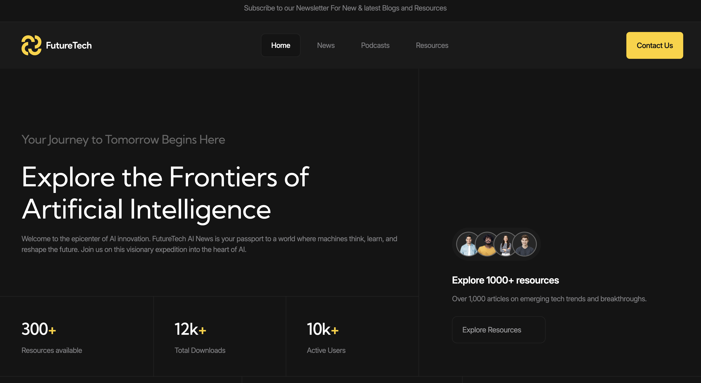
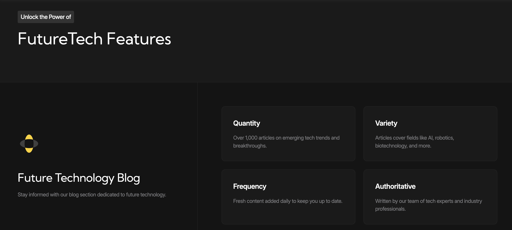
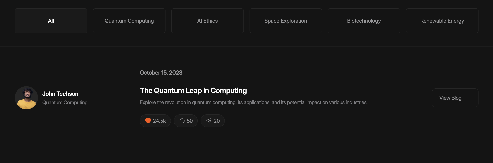
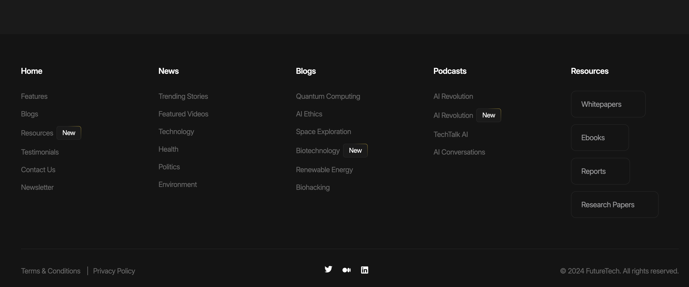
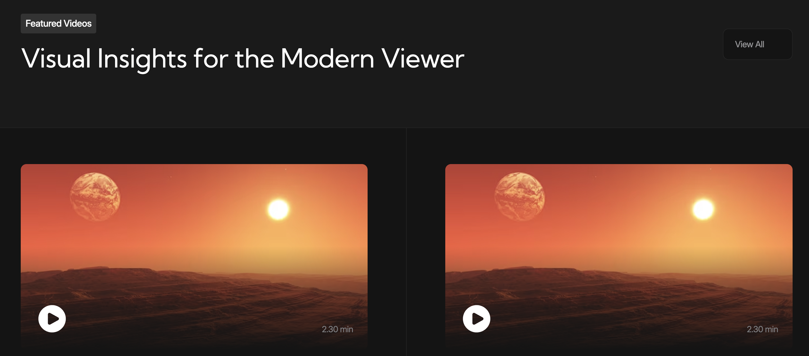
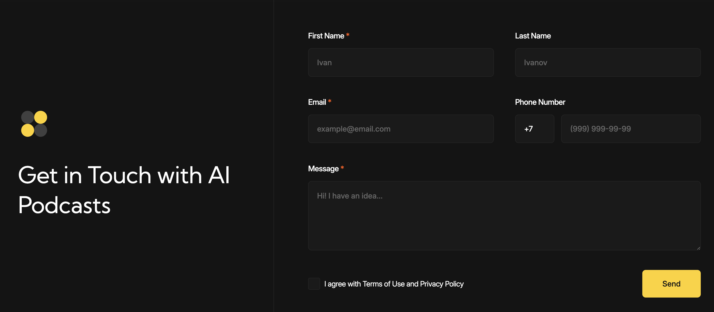
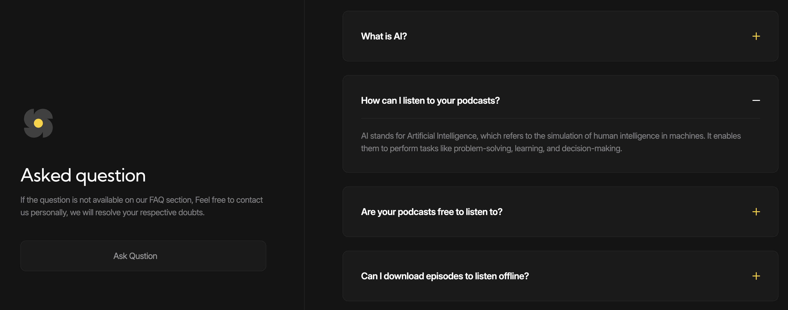

# Future Tech — Многостраничный сайт о технологиях будущего и ИИ

**Future Tech** — это учебный многостраничный адаптивный сайт, посвящённый современным цифровым технологиям, искусственному интеллекту, новостям, подкастам и полезным ресурсам. Проект реализован по принципам компонентной архитектуры с использованием JavaScript-модулей, классов и SCSS (Sass).

---

## 🌐 Страницы сайта

- 🏠 Главная
- 📰 Новости
- 🎧 Подкасты
- 📚 Ресурсы
- 📞 Контакты

---

## ⚙️ JavaScript-архитектура

JavaScript-код написан на **ES6+**, модульно, с использованием **классов** и базового класса `BaseComponent`, реализующего реактивное состояние через `Proxy`. Это позволило строить изолированные, переиспользуемые компоненты.

**Инициализация компонентов:**

---

## 🧩 Реализованные компоненты

- ✅ `Header` — адаптивное бургер-меню с блокировкой прокрутки и поддержкой ARIA
- ✅ `Tabs` — доступные табы с переключением по клавиатуре и фокус-менеджментом
- ✅ `VideoPlayer` — собственный видеоплеер с контролами и UI
- ✅ `ExpandableContent` — анимируемые блоки с `Web Animations API`
- ✅ `InputMask` — маска ввода для полей с помощью библиотеки [`imask.js`](https://imask.js.org/)
- ✅ `Select` — полноценный кастомный селект:
  - поддерживает клавиатуру,
  - использует ARIA и `tabindex`,
  - позиционируется в зависимости от viewport,
  - синхронизирован с оригинальным `<select>`,
  - адаптируется для мобильных через `MatchMedia`

---

## 🎨 Стилизация и SCSS

Стили написаны на **Sass (SCSS)** с использованием:

- переменных, вложенности и миксинов;
- адаптивной типографики (`clamp()` и др.);
- `flex`, `grid`, `media queries`;
- БЭМ-нотации и модульного подхода;
- переменных и тем для масштабируемости.

---

## 🛠 Используемые технологии

- HTML5 (семантическая структура)
- JavaScript (ES6+), классы и модули
- SCSS (Sass) для масштабируемой стилизации
- Web Animations API
- Библиотека `imask.js` для ввода
- CSS Grid / Flexbox
- ARIA-атрибуты и доступность (a11y)
- Mobile-first адаптивный дизайн

---

## 🧠 Полученные навыки

- Построение многостраничных адаптивных сайтов
- Создание переиспользуемых UI-компонентов без фреймворков
- Работа с нативными API (`Proxy`, `MatchMedia`, `Web Animations`)
- Повышение доступности интерфейсов
- Организация JavaScript-кода по компонентной архитектуре
- Стилизация через SCSS и грамотная структура проекта

---

## 📁 Возможности расширения

- Интеграция с фреймворками (React, Vue)
- Подключение backend-части (например, через API)
- Добавление анимации прокрутки, темной темы и динамической загрузки контента

---

## 📸 Превью

